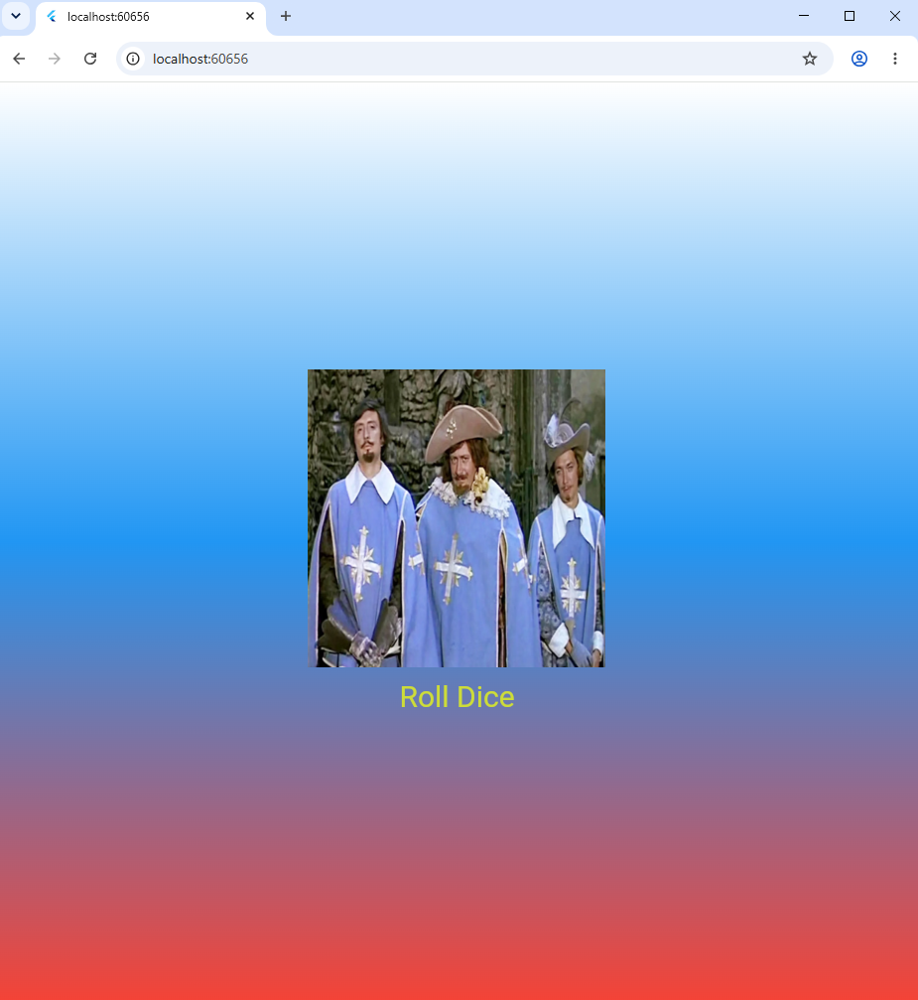

# Лабораторная работа №4-5. Flutter: структура UI и компонентный подход

Дудаков Иван\
ИСП-241\
05.10.2026

---

## Было изучено:

1. Создание классов-виджетов
2. Добавление изображения
3. Добавление кнопок
4. Генерация случайных чисел
5. StatefulWidget и управление состоянием виджета

---

---

[GitHub репозиторий](https://github.com/mirror344/Flutter_Lab4)

---

## Инструкция по запуску

1. Клонировать репозиторий `git clone <url>`
2. Перейти в папку репозитория `cd Flutter_Lab4`
3. Запустить в Chrome `flutter run -d chrome`, в Edge `flutter run -d edge`

---

## Ответы на вопросы
1. Выносить виджеты в отдельные файлы нужно для лучшей читаемости кода. Если держать весь код в `main.dart` приложение продолжит работать, но чтение кода человеком сильно ухудшится и при изменении или добавлении чего-либо в код возникнут трудности.
2. BuildContext это объект, который содержит информацию о положении виджета в дереве. Метод build() принимает его как параметр потому, что при построении интерфейса виджету часто нужно получать информацию из окружающего дерерва.
3. StatelessWidget отрисовывает виджет один раз и они больше не меняются, а StatefulWidget позволяет менять виджет во время выполнения программы. StatelessWidget обычно используется для вывода текста, картинки фона, а StatefulWidget используется для всех нестатичных объектов, например, счетчик или таймер.
4. Random() создаётся на уровне файла, потому что если создавать его в rollDice() при нажатии кнопки будет создаваться новый генератор случайных чисел, это менее эффективно.
